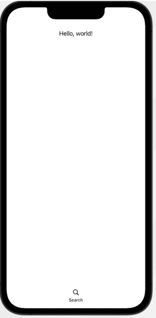
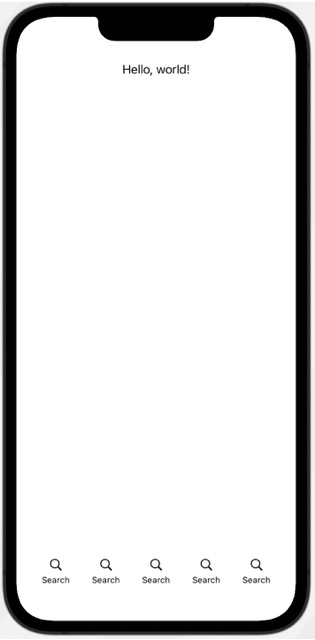
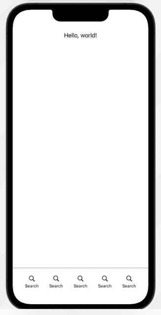

#  Custom SwiftUI TabViews
This repo shows you how to create custom tab views within SwiftUI for iPhone apps. From the awesome CodeWithChris+ Design course:
https://learn.codewithchris.com/courses/take/design/lessons/26070057-lesson-2-custom-tab-bars

# Creating the Custom TabView
## Basic Custom View
Essentially, you create a custom `TabView` by making a `VStack` with a `Spacer`:


```
import SwiftUI

struct ContentView: View {
    var body: some View {
        VStack {
            Text("Hello, world!")
                .padding()
            
            Spacer()
            
            // MARK: Custom Tab View
            VStack(spacing: 5) { // Adds space between the elements inside
                Image(systemName: "magnifyingglass")
                Text("Search")
                    .font(.caption)
            }
            .padding(.vertical)
        }
        .ignoresSafeArea(edges: .bottom)
    }
}

struct ContentView_Previews: PreviewProvider {
    static var previews: some View {
        ContentView()
    }
}
```

## Multiple Custom Tabs
We need to use a GeometryReader in order to utilize all of the space at the bottom of the
screen. In addition, note below that we dynamically generate the tab views with a `ForEach`
loop. However, you can simply cut these out with individual `VStacks` in order to generate 
what you want:

```
import SwiftUI

struct ContentView: View {
    var body: some View {
        
        // Use a GeometryReader in order to take the entire space
        GeometryReader { geo in
            
            VStack {
                Text("Hello, world!")
                    .padding()
                
                Spacer()
                
                // MARK: Custom Tab View
                HStack(spacing: 0) { // Set spacing to zero to manage our own space
                    
                    // Use Spacer here and underneath to center all elements in between
                    Spacer()
                    
                    // Dynamically generate five tabs
                    ForEach(0..<5, id: \.self) { _ in
                        
                        VStack(spacing: 5) { // Adds space between the elements inside
                            Image(systemName: "magnifyingglass")
                            Text("Search")
                                .font(.caption)
                        }
                        .padding(.vertical)
                        // Create a frame around each one, minus 40, because of 20 padding on each side, then divided by five, because of five elements
                        .frame(width: (geo.size.width - 40)/5)
                        
                    }
                    .ignoresSafeArea(edges: .bottom)
                    
                    // Second spacer pushes everything to the left
                    Spacer()
                    
                }
            }
            
            
        }
        
    }
}

struct ContentView_Previews: PreviewProvider {
    static var previews: some View {
        ContentView()
    }
}

```

## Custom Tab Bar
Next, we can add a custom tab bar by using a `Path` to draw one, then making sure it fits within the
frame of the search icons:

```
import SwiftUI

struct ContentView: View {
    var body: some View {
        
        // Use a GeometryReader in order to take the entire space
        GeometryReader { geo in
            
            VStack {
                Text("Hello, world!")
                    .padding()
                
                Spacer()
                
                // MARK: Custom Tab Bar
                VStack {
                    
                    Path({ path in
                        
                        // Tell it to go to the center of the frame
                        path.move(to: CGPoint(x: 0, y: 0))
                        
                        // Create the line using the entire width with the geo at the same height
                        path.addLine(to: CGPoint(x: geo.size.width, y: 0))
                        
                    })
                        .stroke(.gray)
                    
                    // MARK: Custom Tab View
                    HStack(spacing: 0) { // Set spacing to zero to manage our own space
                        
                        // Use Spacer here and underneath to center all elements in between
                        Spacer()
                        
                        // Dynamically generate five tabs
                        ForEach(0..<5, id: \.self) { _ in
                            
                            VStack(spacing: 5) { // Adds space between the elements inside
                                Image(systemName: "magnifyingglass")
                                Text("Search")
                                    .font(.caption)
                            }
                            .padding(.vertical)
                            // Create a frame around each one, minus 40, because of 20 padding on each side, then divided by five, because of five elements
                            .frame(width: (geo.size.width - 40)/5, height: 60) // Keeps this from using all the space, so custom tab bar shows
                            
                        }
                        .ignoresSafeArea(edges: .bottom)
                        
                        // Second spacer pushes everything to the left
                        Spacer()
                        
                    }
                    
                }
                .frame(height: 70) // Makes entire frame of the VStack 70, so the tab bar comes down on top of the search icons
                
            }
            
        }
        
    }
}
```

